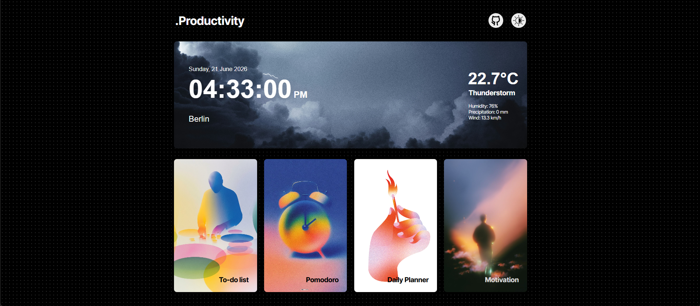

# Productivity Dashboard

A modern productivity dashboard built with Vanilla JavaScript, HTML, and CSS.

## Preview



## Live Demo
https://productivity-dashboard-two-omega.vercel.app

## Features

### Weather Widget
- Auto detects user's location
- Shows real-time weather data using Open-Meteo API
- Displays:
  - Temperature
  - Humidity
  - Precipitation
  - Wind Speed
- Dynamic weather background
- Fallback to Berlin weather if location access is denied

### Live Clock
- Real-time digital clock
- Current date display

### Todo List
- Add tasks
- Edit tasks
- Delete tasks
- Mark tasks as completed
- Important task indicator
- Task detail viewer
- Data persistence using Local Storage

### Pomodoro Timer
- 25-minute focus session
- 5-minute break session
- Start / Stop / Reset controls
- Automatic session switching

### Daily Planner
- Hourly planning schedule
- Local Storage support
- Persistent daily routine tracking

### Motivation Section
- Random motivational quotes
- External quote API integration

### Theme Support
- Dark / Light mode
- Theme persistence using Local Storage

### Responsive Design
- Desktop layout
- Tablet layout
- Mobile layout

---

## Tech Stack

- HTML5
- CSS3
- JavaScript (ES6)
- Local Storage
- Open-Meteo API
- OpenStreetMap Nominatim API

---

## Project Structure

```text
assets/
css/
js/
Preview/
index.html
```

---

## Installation

Clone the repository:

```bash
git clone https://github.com/iharshkaran/productivity-dashboard.git
```

Move into project directory:

```bash
cd productivity-dashboard
```

Run with:

```bash
npm install
npm run dev
```

---

## Learning Outcomes

This project helped me practice:

- DOM Manipulation
- API Fetching
- Async/Await
- Local Storage
- Responsive Design
- Component-like JavaScript Structure
- Theme Management
- Real-world UI Development

---

## Author

Built with ❤️ by Harsh